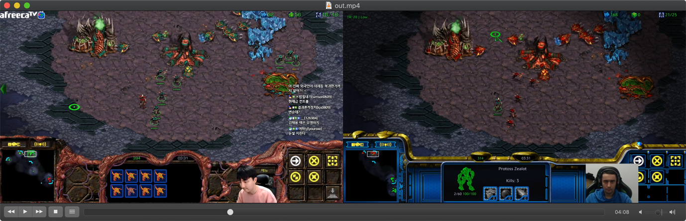

[](https://opensource.org/licenses/MIT)

# splitvod.js

A very simple single-file command-line tool that generates [ffmpeg](https://www.ffmpeg.org/) commands to create split-screen vods.

<p align="center"><a href="https://www.youtube.com/watch?v=fcH93rgsQCI"></a></p>

## Usage

Type `--help` to get usage information:

```
usage: splitvod.js [-h] [-v] [--left-video N] [--output-height PIXELS] [--test]
                   -a FILE SYNC START END [VOL] -b FILE SYNC [VOL]

Generates ffmpeg commands for creating a split FPVOD.

arguments:
  -h, --help              show this help message and exit
  -v, --version           show program's version number and exit
  --left-video {A,B,AB}   whether A/B is on the left side (default: AB [random])
  --output-height PIXELS  which height to use for the output (default: 1080)
  --test                  whether to enable sync test (only 15 secs encode)

video information:
  -a FILE SYNC START END [VOL]  filename, sync, start/end and volume data for A
  -b FILE SYNC [VOL]            filename, sync and volume data for B

example:
  splitvod.js -a "stream1.mp4" "3:53:16.082" "3:50:59.214" "4:05:51.942" "0.2" \
              -b "stream2.mp4" "2:29:00.976" "0.8"
```

For each set of two videos, they'll need a specific timestamp where they're both synced up (note: [the Time extension for VLC Player](https://addons.videolan.org/p/1154032) is a good way to find it). Then one of the two videos needs to have a start and end timestamp (the start/end timestamps for the other video will be calculated automatically based on the sync point).

Timestamps should be given in HH:MM:SS.MS format.

For example:

```
./splitvod.js -a "stream1.mp4" "3:53:16.082" "3:50:59.214" "4:05:51.942" "0.2" -b "stream2.mp4" "2:29:00.976" "0.8"
```

```
Input files:              | Start:        Sync:         End:          Length:       Volume: 
--------------------------+-----------------------------------------------------------------
stream2.mp4               | 2:26:44.108   2:29:00.976   2:41:36.836   14:52.728     0.8     
stream1.mp4               | 3:50:59.214   3:53:16.082   4:05:51.942   14:52.728     0.2     
--------------------------+-----------------------------------------------------------------

ffmpeg -y -ss "2:26:44.108" -i "stream2.mp4" -ss "3:50:59.214" -i "stream1.mp4" -t "14:52.728" -filter_complex "[0:v]scale=-1:1080,fade=type=in:duration=1:start_time=0.05,fade=type=out:duration=1:start_time=891.728[v0];[1:v]scale=-1:1080,fade=type=in:duration=1:start_time=0.05,fade=type=out:duration=1:start_time=891.728[v1];[v0][v1]hstack=inputs=2[v];[1:a]volume=0.2,afade=type=in:duration=1:start_time=0,afade=type=out:duration=1:start_time=891.728[a1];[0:a]volume=0.8,afade=type=out:duration=1:start_time=891.728,afade=type=out:duration=1:start_time=891.728[a0];[a0][a1]amerge=inputs=2[a]" -map "[v]" -map "[a]" -ac 2 "out.mp4"
```

The given ffmpeg command will generate a splitscreen video that you can then upload to Youtube or some other place.

## License

MIT license
